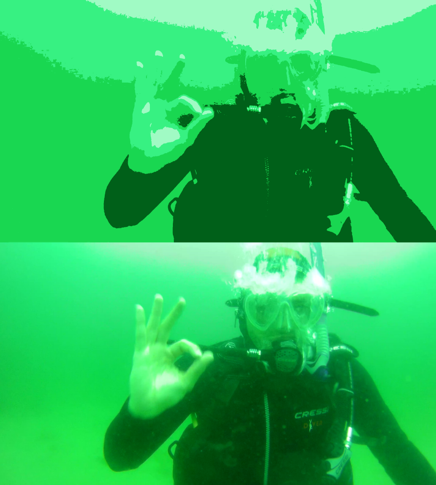

# color-summarizer
Color summarizer with clustering techniques

## Arguments
test= picture to transform
n_colours= number of colours of resulting image
method= currently supporting gaussian mixture "mixture" and kmeans "kmeans"

